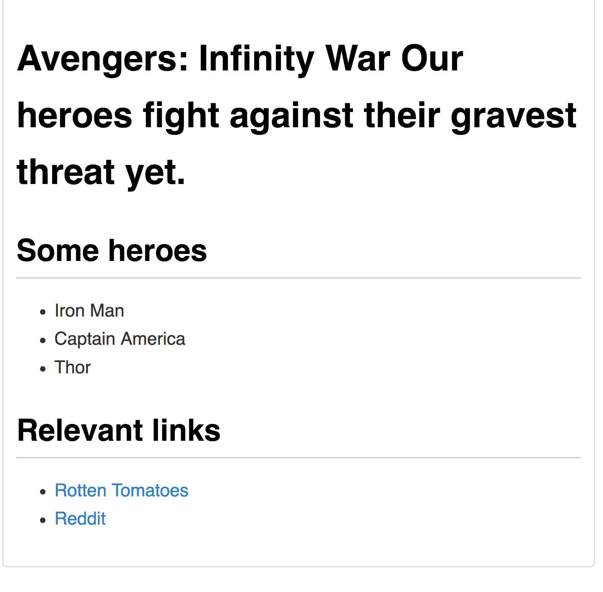
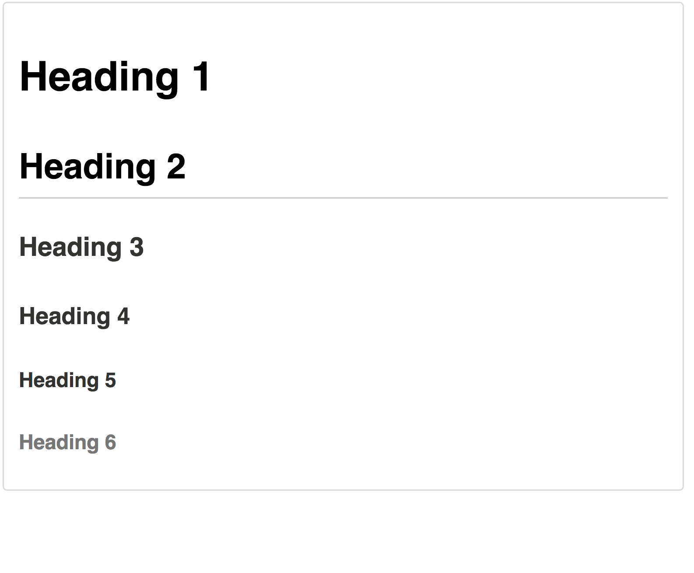
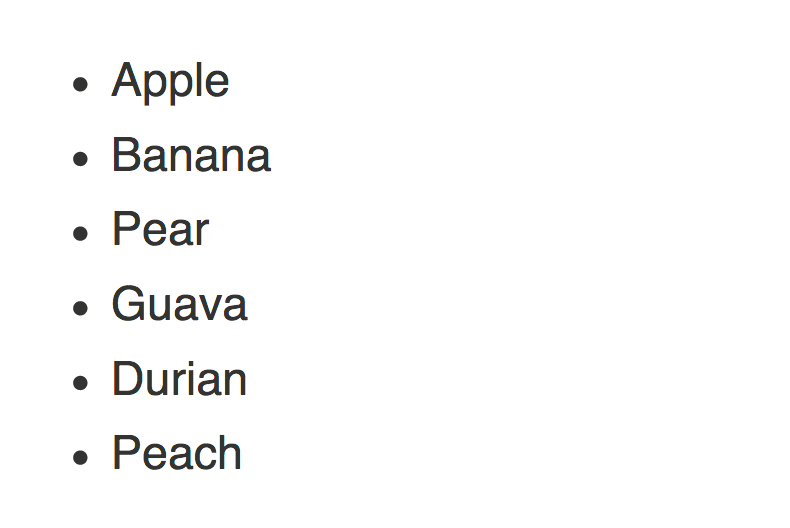
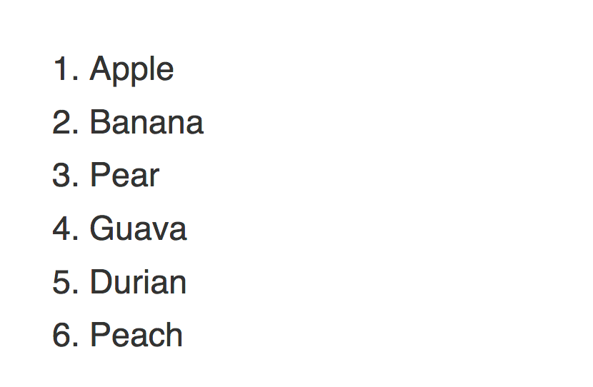
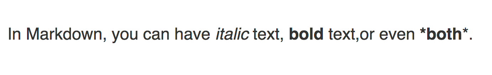
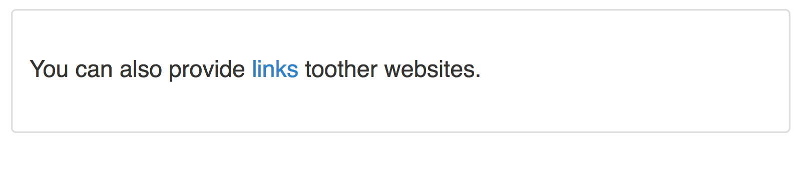
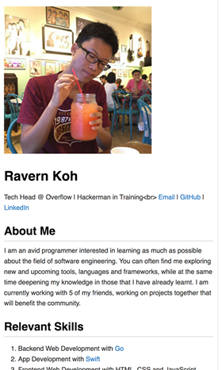

# Markdown

A lightweight markup language

---

### Setting up

Sign up at [Github](https://github.com)

---

### What is Markdown?

- *Clean* and **simple** language for creating content
- Easily converted to other more complex languages

---

### A quick example

```
# Avengers: Infinity War
Our heroes fight against their gravest threat yet.

## Some heroes
- Iron Man
- Captain America
- Thor


## Relevant links
- [Rotten Tomatoes](https://www.rottentomatoes.com/m...
- [Reddit](https://www.reddit.com/r/InfinityWar/comm...
```

+++

### What it looks like



---

## Let's begin!

---

### Headings

```
# Heading 1
## Heading 2
### Heading 3
#### Heading 4
##### Heading 5
###### Heading 6
```

+++

### What it looks like



---

### Unordered lists

```
- Apple
- Banana
* Pear
* Guava
+ Durian
+ Peach
```

+++

### What it looks like



---

### Ordered lists

```
1. Apple
2. Banana
3. Pear
4. Guava
5. Durian
6. Peach
```

+++

### What it looks like



---

### Bold and italics

```
In Markdown, you can have *italic* text, **bold** text,
or even ***both***.
```

+++

### What it looks like



---

### Links

```
You can also provide [links](https://google.com) to
other websites.
```

+++

### What it looks like



---

### Pictures

```
Images are similar to links, except that a '!' is placed
at the front.

.

---

## Activity time!

---

### Self introduction page

For today's activity, we shall be creating a **self introduction
page** using Markdown.

+++

### What it will look like



+++

### Source code

Here is the link to the [sample](https://raw.githubusercontent.com/np-overflow/2018-sessions/01-markdown/assets/sample.md)
and its [source code](https://github.com/np-overflow/2018-sessions/blob/01-markdown/assets/sample.md)
for your reference.

---

### Previewing your Markdown

To preview what your Markdown will look like, you can use
[this tool](http://markdownlivepreview.com/).

---

### Adding your page to Overflow's website

You can add your page to the Overflow website using GitHub,
by submitting a **Pull Request**.

<small>Make sure to use `underscore_casing.md` when you submit your
file.</small>

---

# Thanks for coming!
P.S. The slides were created in Markdown!
